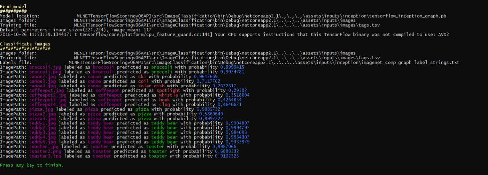
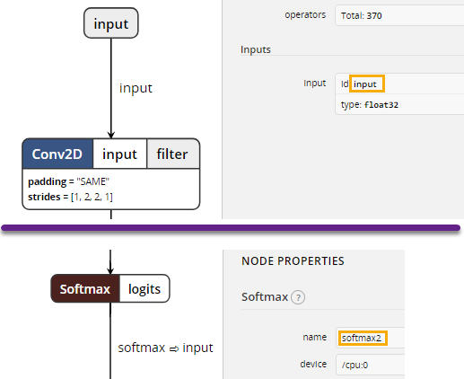

# Класифициране на картинки - Примерно приложение

| ML.NET version | API type          | Status                        | App Type    | Data type | Scenario            | ML Task                   | Algorithms                  |
|----------------|-------------------|-------------------------------|-------------|-----------|---------------------|---------------------------|-----------------------------|
| v1.5.0           | Dynamic API | up-to-date | Console app | Images and text labels | Images classification | TensorFlow Inception5h  | DeepLearning model |


## Проблем
Класификацията на изображения е често срещан случай в много бизнес сценарии. За тези случаи можете или да използвате предварително обучени модели, или да обучите свой собствен модел, за да класифицирате изображения, специфични за вашия потребителски домейн.

## Дата сет
Има два източника на данни: файлът `tsv` и файловете с изображения. Файлът [tsv](./ImageClassification/assets/inputs/images/tags.tsv) съдържа две колони: първата е дефинирана като „ImagePath“, а втората е „Етикетът“, съответстващ на изображението. Както можете да забележите, файлът няма заглавен ред и изглежда така:
```tsv
broccoli.jpg	broccoli
broccoli.png	broccoli
canoe2.jpg	canoe
canoe3.jpg	canoe
canoe4.jpg	canoe
coffeepot.jpg	coffeepot
coffeepot2.jpg	coffeepot
coffeepot3.jpg	coffeepot
coffeepot4.jpg	coffeepot
pizza.jpg	pizza
pizza2.jpg	pizza
pizza3.jpg	pizza
teddy1.jpg	teddy bear
teddy2.jpg	teddy bear
teddy3.jpg	teddy bear
teddy4.jpg	teddy bear
teddy6.jpg	teddy bear
toaster.jpg	toaster
toaster2.png	toaster
toaster3.jpg	toaster
```
Изображенията за обучение и тестване се намират в папките с активи. Тези изображения принадлежат на Wikimedia Commons.
> *[Wikimedia Commons](https://commons.wikimedia.org/w/index.php?title=Main_Page&oldid=313158208), безплатното медийно хранилище.*:  
> https://commons.wikimedia.org/wiki/Pizza  
> https://commons.wikimedia.org/wiki/Coffee_pot  
> https://commons.wikimedia.org/wiki/Toaster  
> https://commons.wikimedia.org/wiki/Category:Canoes  
> https://commons.wikimedia.org/wiki/Teddy_bear  

## Предварително обучен модел
Има множество модели, които са предварително обучени за класифициране на изображения. В този случай ще използваме модел, базиран на топология Inception и обучен с изображения от Image.Net. Този модел може да бъде изтеглен от https://storage.googleapis.com/download.tensorflow.org/models/inception5h.zip, но също така е достъпен на адрес `/ src / ImageClassification / assets / inputs / inception / tensorflow_inception_graph.pb`.

##  Решение
Проектът за конзолно приложение „ImageClassification.Score“ може да се използва за класифициране на примерни изображения въз основа на предварително обучения модел Inception-5h TensorFlow.

Отново имайте предвид, че тази проба използва/консумира само предварително обучен модел TensorFlow с ML.NET API. Следователно той **не** обучава нито един ML.NET модел. Понастоящем TensorFlow се поддържа само в ML.NET за точкуване/прогнозиране със съществуващи обучени модели на TensorFlow.

Трябва да следвате следващите стъпки, за да изпълните теста за класификация:

1) **Задайте VS проект за стартиране по подразбиране:** Задайте `ImageClassification.Score` като стартиращ проект във Visual Studio.
2) **Стартирайте конзолното приложение за модел на обучение:** Натиснете F5 във Visual Studio. В края на изпълнението изходът ще бъде подобен на тази екранна снимка:



##  Преглед на кода
Има един единствен проект в решението, наречен `ImageClassification.Score`, който отговаря за зареждането на модела във формат TensorFlow и след това за класифицирането на изображенията.

### ML.NET: Точкуване на модела

Дефинирайте схемата на данните в тип клас и препратете този тип, докато зареждате данни с помощта на TextLoader. Тук типът клас е ImageNetData.

```csharp
public class ImageNetData
{
    [LoadColumn(0)]
    public string ImagePath;

    [LoadColumn(1)]
    public string Label;

    public static IEnumerable<ImageNetData> ReadFromCsv(string file, string folder)
    {
        return File.ReadAllLines(file)
         .Select(x => x.Split('\t'))
         .Select(x => new ImageNetData()
         {
             ImagePath = Path.Combine(folder, x[0]),
             Label = x[1],
         });
    }
}
```
Първата стъпка е да заредите данните с помощта на TextLoader

```csharp
var data = mlContext.Data.ReadFromTextFile<ImageNetData>(dataLocation, hasHeader: true);
```

Файлът с изображение, използван за зареждане на изображения, има две колони: първата е дефинирана като „ImagePath“, а втората е „Етикетът“, съответстващ на изображението.

Важно е да се подчертае, че етикетът в класа „ImageNetData“ всъщност не се използва при точкуване с модела TensorFlow. Използва се при тестване на прогнозите, за да можете да сравните действителния етикет на всяка примерна информация с прогнозния етикет, предоставен от модела TensorFlow. 

```csv
broccoli.jpg	broccoli
bucket.png	bucket
canoe.jpg	canoe
snail.jpg	snail
teddy1.jpg	teddy bear
```
Както можете да забележите, файлът няма заглавен ред.

Моделът Inception има няколко параметъра по подразбиране, които трябва да въведете.

```csharp
public struct ImageNetSettings
{
    public const int imageHeight = 224;
    public const int imageWidth = 224;
    public const float mean = 117;
    public const bool channelsLast = true;
}                
```

Втората стъпка е да се определи конвейерът на оценителя. Обикновено, когато работите с дълбоки невронни мрежи, трябва да адаптирате изображенията към формата, очакван от мрежата. Това е причината изображенията да се преоразмеряват и след това да се трансформират (главно стойностите на пикселите се нормализират във всички R,G,B канали).

```csharp      
var pipeline = mlContext.Transforms.LoadImages(outputColumnName: "input", imageFolder: imagesFolder, inputColumnName: nameof(ImageNetData.ImagePath))
    .Append(mlContext.Transforms.ResizeImages(outputColumnName: "input", imageWidth: ImageNetSettings.imageWidth, imageHeight: ImageNetSettings.imageHeight, inputColumnName: "input"))
    .Append(mlContext.Transforms.ExtractPixels(outputColumnName: "input", interleavePixelColors: ImageNetSettings.channelsLast, offsetImage: ImageNetSettings.mean))
    .Append(mlContext.Model.LoadTensorFlowModel(modelLocation)
        .ScoreTensorFlowModel(outputColumnNames: new[] { "softmax2" }, inputColumnNames: new[] { "input" },
            addBatchDimensionInput:true));
```
Също така трябва да проверите невронната мрежа и да проверите имената на входните / изходните възли. За да проверите модела, можете да използвате инструменти като [Netron](https://github.com/lutzroeder/netron), който се инсталира автоматично с [Visual Studio Tools for AI](https://visualstudio.microsoft. com/downloads/ai-tools-vs/).
Тези имена се използват по-късно в дефиницията на тръбата за оценка: в случая на началната мрежа, входният тензор се нарича „вход“, а изходът се нарича „softmax2“.


Накрая извличаме двигателя за прогнозиране след *напасване* на конвейера на оценителя. Машината за прогнозиране получава като параметър обект от тип `ImageNetData` (съдържащ 2 свойства: `ImagePath` и `Label`), след което връща и обект от тип `ImagePrediction`.
```
ITransformer model = pipeline.Fit(data);
var predictionEngine = mlContext.Model.CreatePredictionEngine<ImageNetData, ImageNetPrediction>(model);
```
Когато получаваме прогнозата, получаваме масив от плаващи елементи в свойството `PredictedLabels`. Всяка позиция в масива е присвоена на етикет, така че например, ако моделът има 5 различни етикета, масивът ще бъде с дължина = 5. Всяка позиция в масива представлява вероятността на етикета в тази позиция; сумата от всички стойности на масива (вероятности) е равна на единица. След това трябва да изберете най-голямата стойност (вероятност) и да проверите кой е присвоеният етикет на тази позиция.

### Цитат
Изображения за обучение и прогнозиране
> *Wikimedia Commons, the free media repository.* Retrieved 10:48, October 17, 2018 from https://commons.wikimedia.org/w/index.php?title=Main_Page&oldid=313158208.
